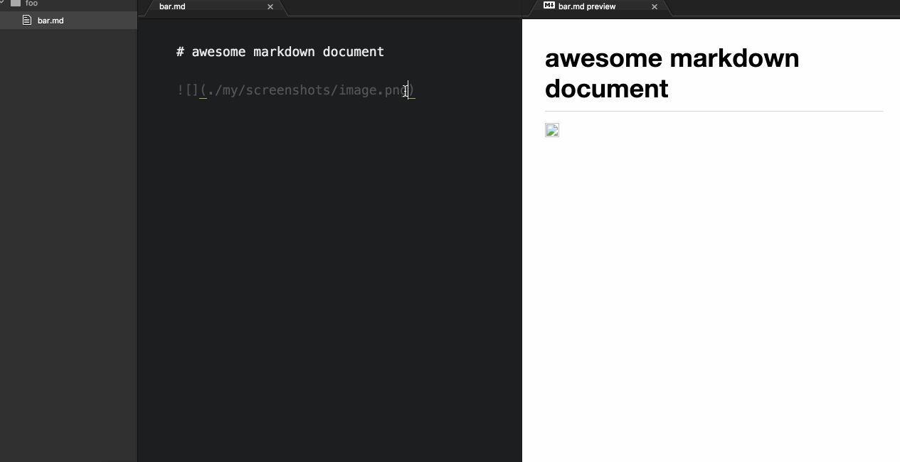

# markdown-insert-screenshot

A lightweight Atom plugin for inserting interactive screenshots into Markdown files.

## How to use it
1. Write the line to display the image you'd *like to* insert, i.e. ``.
2. Highlight the relative path with your cursor, i.e. `../figures/my_screenshot.png`.
3. Run `markdown-insert-screenshot:screenshot-to-relative-destination` from the Command Palette or invoke the keymap `cmd-@`.
4. At this point, an interactive cursor will appear; switch to your desired window, drag-and-capture your desired selection, then release. The screenshot will be saved to your specified destination and immediately available in a Markdown preview tab.

## Example usage (GIF in https://github.com/cavaunpeu/markdown-insert-screenshot)

